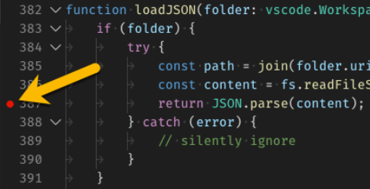
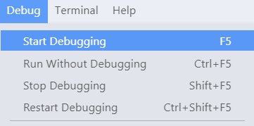
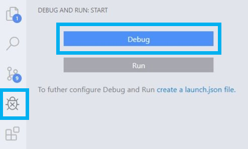
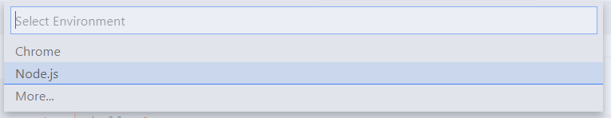
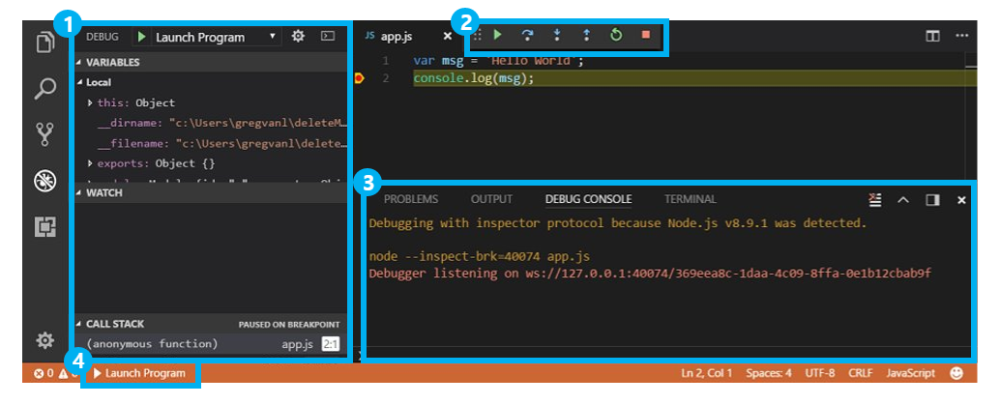
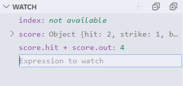
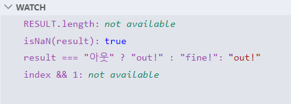
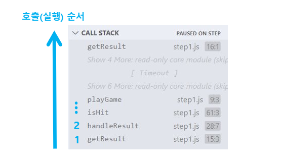
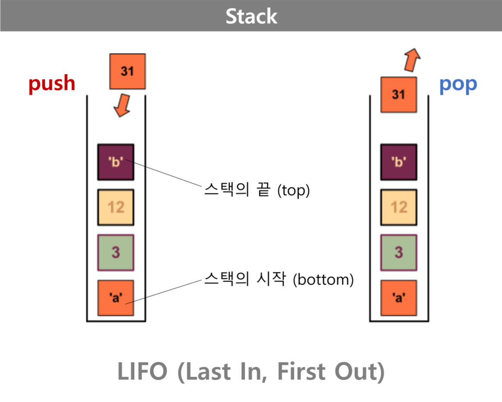
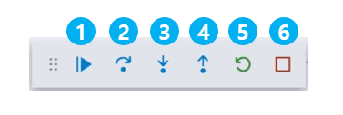

# General debugging features in VSCode

VSCode에는 Node.js, Javascript, TypeScript를 비롯해서 Javascript로 트랜스파일되는 언어들을 디버깅할 수 있는 기능이 내장되어 있다.

VSCode에서 디버깅을 시작하는 방법과 디버깅시 제공되는 인터페이스에 대해 알아보자.

## VSCode에서 디버깅 시작하기

### 1. 디버깅 하려는 코드가 포함된 파일을 연다.

 

### 2. breakpoint를 추가한다.

> **breakpoint** breakpoint를 직역하면 '멈추는(break) 지점(point)'이다. 이름대로 프로그램 실행을 '일시 중지'할 지점을 말한다. 디버깅시 breakpoint에서 코드의 실행을 멈추고 해당 시점의 실행 정보(변수 정보, 콜스택 등)를 검사할 수 있다.

- breakpoint는 아래 이미지에서 화살표가 가리키는 부분(에디터 영역의 왼쪽 마진)을 클릭하거나, 코드를 클릭한 후 `F9`를 눌러서 추가(또는 제거)할 수 있다.

  

- breakpoint가 지정되면 위와 같이 빨간색 점이 표시된다.

 

### 3. 디버깅을 시작한다.

아래의 방법들 중 하나를 실행한다.

> - 방법1 ─ `F5`를 누른다.
>
> - 방법2 ─ vscode 상단 메뉴의 `Debug > Start Debugging`을 선택한다.
>
>   
>
> - 방법3 ─ vscode 왼쪽에 위치한 메뉴에서 'Debug and Run'을 선택하고 Debug > 버튼을 클릭한다.
>
>   

vscode 상단에 환경 선택 메뉴가 나타나면 원하는 개발환경을 선택하여 디버깅을 시작한다.

 

---

디버깅 설정하기 ─ `Launch configurations`

---

간단한 앱의 경우 위 순서에 따라 디버깅을 시작할 수 있지만, 보다 세부적인 설정이 필요한 경우 launch configuration 파일을 생성하여 디버깅에 필요한 여러가지 설정을 할 수 있다.

- [launch configurations](https://code.visualstudio.com/docs/editor/debugging#_launch-configurations)
- [launch.json attributes 1](https://code.visualstudio.com/docs/editor/debugging#_launchjson-attributes)
- [launch.json attributes 2](https://code.visualstudio.com/docs/nodejs/nodejs-debugging)

 

## 디버거 인터페이스 알아보기

디버깅을 시작하면 vscode에서 다음과 같은 요소들이 제공된다. 해당 요소들을 이용해서 코드 실행을 제어하고 디버깅 결과를 확인할 수 있다.

(1) Debug View 
(2) Debug Toolbar 
(3) Debug Console 
(4) Debug Side Bar

 

### (1) Debug View

코드 실행 정보가 표시되는 영역이다. 다음과 같이 5개의 섹션으로 구성되어 있다.

1. [**VARIABLES**](https://code.visualstudio.com/docs/editor/debugging#_data-inspection)

실행 시점의 변수 정보가 표시된다.

- `Local` ─ 지역 변수 정보
- `Closure` ─ 클로저 변수 정보
- `Global` ─ 전역 변수 정보

변수값을 더블클릭해서 새로운 값으로 수정할 수 있다.

> 참고) 변수 정보는 에디터 영역에서 '변수명에 마우스 오버'하여 확인할 수도 있다.

2. [**WATCH**](https://code.visualstudio.com/docs/editor/debugging#_data-inspection)

코드의 실행에 따른 여러 개의 변수 또는 표현식(expression)의 값을 표시하는 섹션이다.

WATCH 섹션의 빈 공간을 더블클릭 하거나 우측 상단의 `+` 버튼을 클릭하여 검사하고자 하는 변수 또는 표현식을 추가할 수 있다.

WATCH 섹션에서 검사할 변수는 현재 디버깅 중인 프로그램 안에 정의된 것이어야 하며, 표현식 역시 프로그램 내에서 정의된 변수에 대한 내용이어야 한다.

변수의 타입을 체크하거나 변수가 가리키는 배열의 길이를 체크하는 등 유효한 자바스크립트 표현식이라면 무엇이든 추가할 수 있다.

3. **CALL STACK**

함수와 메서드가 호출되는 순서가 표시되는 섹션으로, 프로그램의 실행 흐름을 파악하는데 유용하다.

 

---

**stack & call stack**

---

**스택 (stack)**

스택(stack)은 컴퓨터가 데이터를 다루는 방법(자료구조)의 하나로, 일종의 '제약이 있는 배열'이라고 생각하면 쉽다. 데이터를 배열처럼 선형(linear)으로 저장하며 다음과 같은 세 가지 제약을 가지고 있다.

- 데이터는 스택의 끝에만 추가할 수 있다.
- 데이터는 스택의 끝에서만 읽을 수 있다.
- 데이터는 스택의 끝에서만 삭제할 수 있다.

이렇게 나중에 넣은 데이터를 먼저 처리하는 특성을 LIFO("Last In, First Out")라고 한다.

  

 

**콜스택 (call stack)**

콜스택이란 '함수의 호출 정보가 차곡차곡 쌓여있는 스택'을 의미한다. 프로그램 내에서 코드의 실행 순서를 기록하는 자료구조인 셈이다.

콜스택 역시 스택이기 때문에 LIFO 방식으로 동작한다. 함수가 호출된 순서대로 스택에 추가되고(push)되고, 호출 순서와는 반대로 맨 마지막에 호출된 함수부터 실행되면서 스택에서 제거(pop)된다.

4. [**LOADED SCRIPTS**](https://code.visualstudio.com/docs/nodejs/nodejs-debugging#_access-loaded-scripts)

외부 모듈을 포함해서 현재 실행중인 코드의 스코프에 load된 모든 script를 보여준다.

LOADED SCRIPTS 섹션에 있는 script파일에 breakpoint를 추가하여 디버깅시 활용할 수도 있다.

`ctrl` + `F4`를 눌러 추가할 script를 선택할 수 있다.

5. [**BREAKPOINTS**](<(https://code.visualstudio.com/docs/editor/debugging#_breakpoints)>)

사용자가 지정한 모든 breakpoint를 보여주는 섹션이다. 체크박스를 사용해서 특정 breakpoint를 활성화 또는 비활성화 할 수 있다.

활성화 상태인 breakpoint는 빨간색 동그라미가 표시되고, 비활성화 상태인 breakpoint는 회색 동그라미가 표시된다.

[node.js breakpoint 설정 >](https://code.visualstudio.com/docs/nodejs/nodejs-debugging#_breakpoints)

 

### (2) Debug Toolbar

디버깅 및 코드의 실행을 제어하는 기능들을 모아놓은 툴바이다. 각각 다음과 같은 기능을 수행한다.

1. **Continue / Pause** ─ `F5`

- ▶️ continue

  - 다음 breakpoint까지 실행을 계속한다.
  - breakpoint가 없을 경우 프로그램 실행이 종료 시점 까지 실행한다.

- ⏸ pause

  - 코드 실행을 멈춘다.

2. **Step Over** ─ `F10`

- 하나의 statement를 실행한 뒤 일시정지 한다.
- 코드에 함수 호출이 포함되어 있을 경우 해당 **함수를 실행한 후 바로 다음 줄로 넘어가서 일시정지** 한다.

3. **Step Into** ─ `F11`

- Step Over와 마찬가지로 하나의 statement를 실행한 뒤 일시정지 한다.
- 하지만 Step Into의 경우 코드에 **함수 호출이 있을 경우 해당 함수로 점프한 뒤 첫번째 줄에서 일시정지** 한다.
- 만약 `func1(func2(func3()))` ← 이렇게 함수 호출이 중첩되어 있을 경우 가장 깊숙히 중첩되어 있는 `func3`까지 이동 한다.

4. **Step Out** ─ `shift` + `F11`

- 현재 함수의 나머지 부분을 실행한 다음 일시 중지한다.

5. **Restart** ─ `ctrl` + `shift` + `F5`

- 디버깅을 처음부터 다시 시작한다.

6. **Stop** ─ `shift` + `F5`

- 디버깅을 종료한다.

 

> 툴바의 맨 왼쪽에 위치하는 6개의 점을 드래그해서 툴바의 위치를 변경할 수 있다.

 

### (3) Debug Console

디버깅 결과가 출력되는 콘솔이다.

 

### (4) Debug Side Bar

등록된 launch 설정값이 있을 경우 현재 활성화된 설정값이 표시되는 영역이다. 영역을 클릭해서 활성화할 launch 설정값을 변경할 수 있다.
